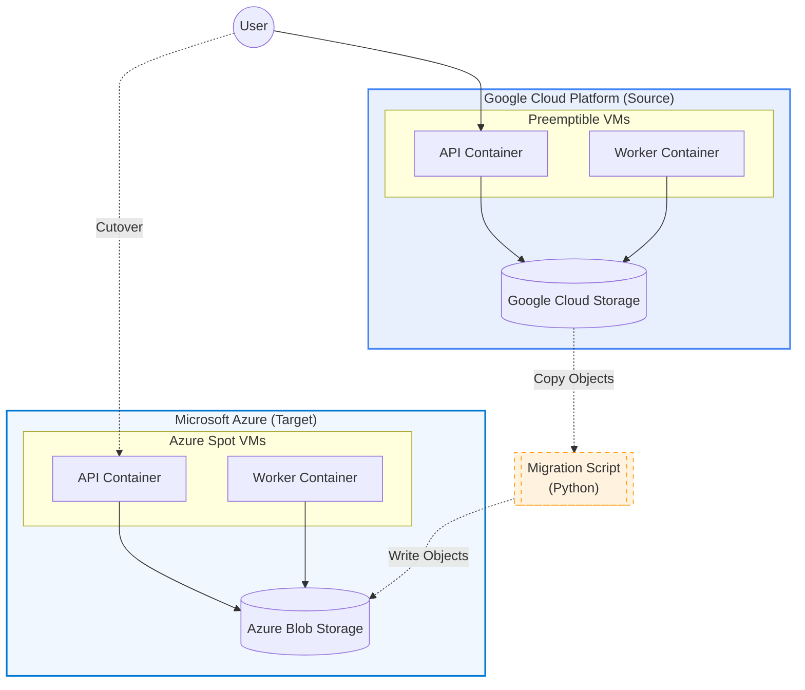

# Cross-Cloud Migration Project: GCP to Azure (Spot Instances)

This project demonstrates a production-style migration of a stateless, interruptible workload from Google Cloud Platform (GCP) to Microsoft Azure. 
The goal is to migrate a containerized application running on GCP Preemptible VMs to Azure Spot VMs, including migrating the object storage data, while maintaining minimal cost and using industry-standard practices.
This project is referenced from the client work type I performed at my last job.

### Medium Article
For detailed step breakdown, follow this Medium Article I wrote about this project: [Medium Article](https://medium.com/@immrbhattarai/how-i-migrated-a-spot-instance-workload-from-gcp-to-azure-for-90-less-cost-4c716d82f1b0)


## 🏗 Architecture & Migration Story

The workload consists of an **API service** (FastAPI) that accepts image processing jobs and a **Worker service** that processes images (grayscale conversion) in the background.

*   **Design Pattern:** Stateless, "Spot-friendly" architecture. State is decoupled from compute and stored in object storage.
*   **Source Cloud (GCP):** 2x Preemptible VMs (API & Worker) + Google Cloud Storage (GCS).
*   **Target Cloud (Azure):** 2x Spot VMs (API & Worker) + Azure Blob Storage.
*   **Migration Strategy:** **"Re-platform / Re-deploy"**. We deploy the same Docker containers to the target infrastructure and perform a data sync for the storage layer.

### Architecture Diagram



## ☁️ Cloud Migration Demo: GCP Preemptible to Azure Spot

This project demonstrates a real-world multi-cloud migration runbook, moving a containerized, stateless image-processing application from Google Cloud Platform (GCP) Preemptible VMs to Azure Spot VMs.

The core goal is to showcase the portability of containerized workloads and implement a migration strategy (ETL + Cutover) while leveraging high cost-saving measures in both cloud environments.

## 📂 Project Structure
```
cloud-migration-spot/
├── api/                    # FastAPI Application (Handles uploads and status)
│   ├── main.py             
│   └── templates/          
├── worker/                 # Background Worker (Handles image resizing)
│   └── worker.py           
├── common/                 # Shared Library (Crucial for multi-cloud abstraction)
│   ├── config.py           # Configuration loader
│   ├── storage.py          # Storage Abstraction (Local/GCS/Azure)
│   └── job_schema.py       # Pydantic Models for job queue
├── infra/docker/           # Infrastructure
│   ├── Dockerfile.api      # API Container Definition
│   └── Dockerfile.worker   # Worker Container Definition
├── tools/                  # Migration Tools
│   └── gcs_to_azure_copy.py # ETL Script for data synchronization
├── requirements.txt        # Python Dependencies
└── README.md               
```


## ⚡ Getting Started (Local Development)

To test the API and Worker components locally without any cloud dependencies:

### Clone the repository:
```
git clone https://github.com/ImmrBhattarai/cloud-migration-spot.git
cd cloud-migration-spot
```
### Build Docker Images:
```
docker build -f infra/docker/Dockerfile.api -t demo-api:local .
docker build -f infra/docker/Dockerfile.worker -t demo-worker:local .
```


### Run Locally (with shared volume):


```
mkdir -p data

# Run API on port 8000
docker run -d -p 8000:8000 -v "$(pwd)/data:/app/data" --name local-api demo-api:local

# Run Worker
docker run -d -v "$(pwd)/data:/app/data" --name local-worker demo-worker:local
```


Access: Open http://localhost:8000 in your browser to upload an image.

## ☁️ Cloud Deployment & Migration Runbook

The application is deployed with the help of environment variables (STORAGE_BACKEND) to abstract the underlying storage technology (GCS or Azure Blob).

Environment Variables Reference

| Variable | Description | Context |
|----------|-------------|---------|
| ```STORAGE_BACKEND``` | ```gcp``` or ```azure``` | All Containers |
| ```GCS_BUCKET``` | Source Bucket Name | GCP Only |
| ```GOOGLE_APPLICATION_CREDENTIALS``` | Path to Service Account JSON | GCP Only |
| ```AZURE_STORAGE_CONNECTION_STRING``` | Storage Account Connection String | Azure Only |
| ```AZURE_CONTAINER``` | Target Blob Container Name | Azure Only |

### Phase 1: Deploy to GCP (Source)

Deploy the services to GCP Preemptible VMs. These services will use GCS for job queuing and image storage.


```
# 1. Start API Service (GCP)
docker run -d --name cm-api -p 80:8000 \
  -e STORAGE_BACKEND=gcp \
  -e GCS_BUCKET=$GCS_BUCKET \
  -e GOOGLE_APPLICATION_CREDENTIALS=/path/to/key.json \
  <your-dockerhub-user>/cloud-migration-demo-api:v2
```


```
# 2. Start Worker Service (GCP)
docker run -d --name cm-worker \
  -e STORAGE_BACKEND=gcp \
  -e GCS_BUCKET=$GCS_BUCKET \
  -e GOOGLE_APPLICATION_CREDENTIALS=/path/to/key.json \
  <your-dockerhub-user>/cloud-migration-demo-worker:v2
```


### Phase 2: Deploy to Azure (Target)

Deploy the services to Azure Spot VMs. These services are configured to use Azure Blob Storage for images and job queue.
```
# 1. Start API Service (Azure)
docker run -d --name cm-api -p 80:8000 \
  -e STORAGE_BACKEND=azure \
  -e AZURE_STORAGE_CONNECTION_STRING="<your-conn-string>" \
  -e AZURE_CONTAINER="cm-demo-images-az" \
  <your-dockerhub-user>/cloud-migration-demo-api:v2
```


```
# 2. Start Worker Service (Azure)
docker run -d --name cm-worker \
  -e STORAGE_BACKEND=azure \
  -e AZURE_STORAGE_CONNECTION_STRING="<your-conn-string>" \
  -e AZURE_CONTAINER="cm-demo-images-az" \
  <your-dockerhub-user>/cloud-migration-demo-worker:v2
```


### Phase 3: Data Migration (ETL)

Use the included tool to copy all existing data from the GCP bucket to the Azure container.
```
# Export credentials for both clouds
export GCS_BUCKET=...
export GOOGLE_APPLICATION_CREDENTIALS=...
export AZURE_STORAGE_CONNECTION_STRING=...
export AZURE_CONTAINER=...

# Run the migration script
python tools/gcs_to_azure_copy.py
```


### Phase 4: Cutover Strategy (Cold Migration)

- **Freeze:** Stop the GCP API container to prevent new data writes.
- **Sync:** Run ```python tools/gcs_to_azure_copy.py``` one last time to ensure consistency.
- **Switch:** Update DNS or client configuration to point traffic to the Azure API's public IP address.
- **Verify:** Test image upload and processing on Azure.
- **Decommission:** Delete GCP resources.

## 💸 Cost Analysis & Cleanup

Why Spot/Preemptible?

- **Cost Savings:** GCP Preemptible and Azure Spot instances offer discounts of up to 90% compared to on-demand pricing.
- **Trade-off:** Instances can be reclaimed by the cloud provider with little warning.
- **Architectural Solution:** The application is built to be stateless. If a worker VM dies, the job remains safely stored in the cloud storage queue (GCS or Azure Blob) and is picked up by a new, available worker instance.

### Cleanup (Critical)

Run these commands to avoid incurring charges after the demo is complete:

Cloud |                         Action                                |                                                           Command                                                     |
------|---------------------------------------------------------------|-----------------------------------------------------------------------------------------------------------------------|
GCP   | Delete VM instances and GCS Buckets.                          | ```gcloud compute instances delete cm-api-vm cm-worker-vm --zone=us-central1-a``` ```gsutil rm -r gs://$GCS_BUCKET``` |
Azure | Delete the entire Resource Group (removes VMs, Storage, IPs). | ```az group delete --name cm-demo-rg --yes --no-wait```                                                               |


## ⚖️ Production Considerations vs. Demo


## ✍️ Author
ImmrBhattarai (Suraj Bhattarai)
